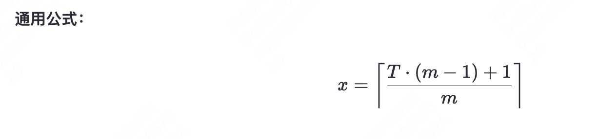

- [牛客汇总](https://www.nowcoder.com/discuss/374239272688254976?sourceSSR=search)
## 如何使用rand5来实现rand7？
``` python
import random
def rand5():
    return random.randint(1, 5)
def rand7():
    while True:
        # Generate a number from 1 to 25
        num = (rand5() - 1) * 5 + rand5()
        if num <= 21:
            # Map the result to 1 to 7
            return (num - 1) % 7 + 1

# Example usage
print(rand7())
```
## 如何使用rand7来实现rand10？
``` python
class Solution:
    def rand10(self):
        while True:
            nums = (rand7() - 1) * 7 + rand7()
            if nums <= 40:
                res = (nums - 1) % 10 + 1
                return res

```
## 如何使用rand10来实现rand7？
- 直接筛选

## 100盏灯按顺序编号，开始时全部关闭。依次按下1的倍数的开关，2的倍数的开关，3的倍数的开关……100的倍数的开关。问最后哪几盏灯是亮着的？
- 完全平方数是亮着的

## 54张扑克牌，平均分成3份，大小王在一份的概率？
## 求pai
## 有25匹马，每场比赛只能赛5匹，至少要赛多少场才能找到最快的3匹马？
## 64匹马，8个跑道，选跑最快的4匹马需要比赛多少次。

## 有两根不均匀的香，燃烧完都需要一个小时，问怎么确定15分钟的时长？
- 点燃一根A，同时点燃另一根B的两端，当另一根B烧完的时候就是半小时。
- 这时再将A的另一端也点燃，从这时到A燃烧完就正好15分钟。

## 水无限。3L和5L水桶各一个，怎样取4L的水？
- 设A是3L，B是5L
- A：0，B：5
- A：3，B：2
- A：2，B：5
- A：3，B：4

## 一个硬币，正面概率0.7，反面概率0.3，现在有一瓶水，怎么掷能让两个人公平的喝到水
- 拋两次，先正后反A喝，先反后正B喝   
## 3个瓶盖可以换一瓶水，问想喝到100瓶水，一开始至少买多少瓶水。
- 3个瓶盖换1瓶水： 需购买 67 瓶。
- 4个瓶盖换1瓶水： 需购买 76 瓶。
- 5个瓶盖换1瓶水： 需购买 81 瓶。
- 